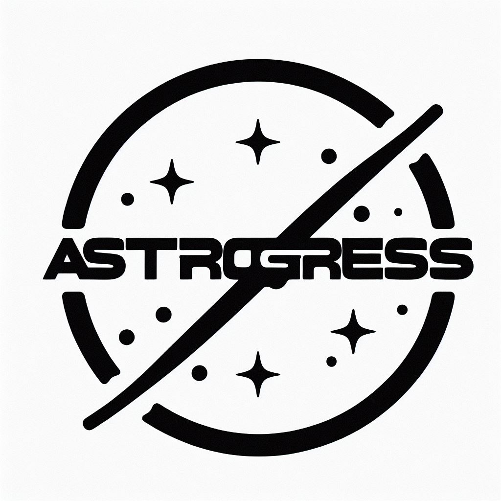

<h1 align="center">AstroGress</h1>

##  📁 **Documents**

<a href = "https://codingburgas-my.sharepoint.com/:p:/g/personal/agharakchiyski22_codingburgas_bg/EarN1XLoGPJMqi5GC3WvnPgB6elAYK1LHaQE8nWTzpKZEQ?e=y6CBwo" target = "_blank">Presentation !</a>
 
<a href = "https://codingburgas-my.sharepoint.com/:w:/g/personal/agharakchiyski22_codingburgas_bg/EVlumYWeuyVIpOIIugD11JgB4gqaxQId-B6rY504EJ1Z5g?e=TdTX2V" target = "_blank">Documentation !</a>

## 📋 Description

Step into the cosmos with our captivating console game, where the worlds of physics and astronomy collide! This isn't just a game; it's an interactive journey that encourages players to explore and deepen their knowledge of the cosmos through a gamified experience. Engage with our console game now!  

## 🚀 Technologies Used

  

## 🔧 Tools

  
  
  
  
  
  

## 👨🏻‍💻 Team Members

| Aleksander Harakchiyski | Scrum Trainer  | 🟨 9A |

| Miroslav Markov |  Backend Developer  | 🟨 9A |

| Iliyan Stanchev | Backend Developer | 🟦 9G |

| Milan Nedelchev | Backend Developer  | 🟦 9G |
